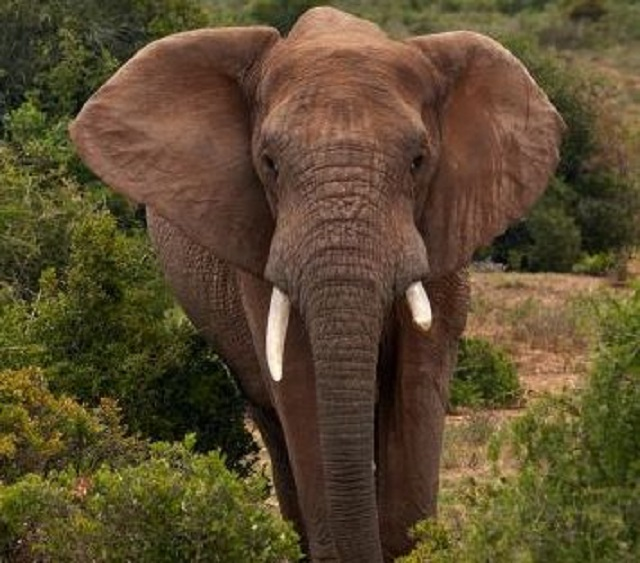

## Elephants

Elephants are the largest living land animals on earth.

---

### Characteristics

They are characterized by long trunk, huge head, columnar legs and flat ears.

---

### Diet

They eat a lot of roots, grasses, fruits and bark.

### Did you know that elephants......

1. **Don't** sleep much.
1. Are **constantly** eating.
1. Tasks are their **actual** teeth.
1. Calves are able to stand within **20 minutes** after birth.

### Note:
Pay close attention to the _italics_. And **bold**, They are very **important**. 
These animals ~~can not~~ be found all over the world.

---

